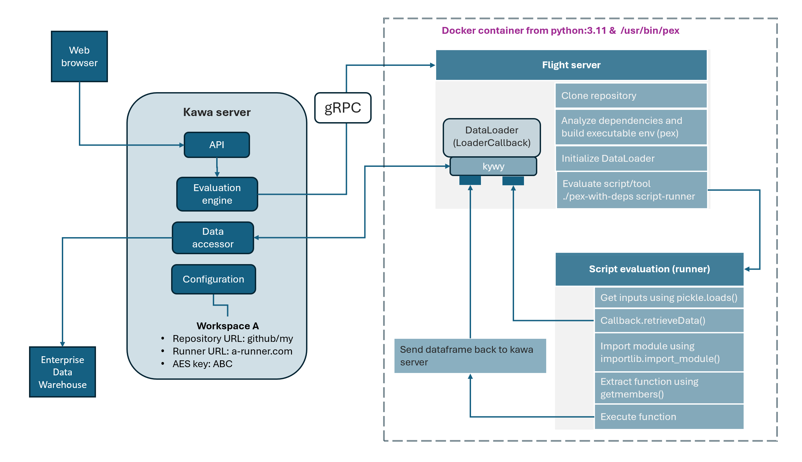
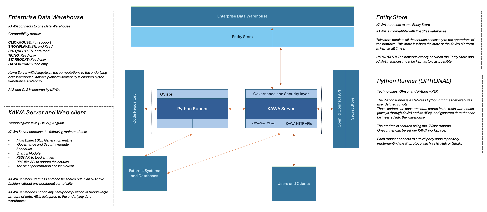

KAWA Docker-compose installation
==============

This setup is ideal for small to medium deployments. 

**It is the recommended way to get started with the KAWA platform.**

Persistence layers are implemented with Clickhouse and Postgres, they can easily be migrated out to standalone servers later on.


It should be paired up with some scheduled backups of the persisted data, either through database backups, or through disk snapshots. This is not covered by this documentation.

Here is what will be installed with this docker-compose setup:

<p align="center">
  
</p>

The script-runner is a separate container that will be used to run the python scripts that are uploaded to KAWA.
The following diagram shows its architecture:

<p align="center">
  
</p>


## 1. Prerequisites

### 1.a General requirements

We currently support Ubuntu Systems 20.04, 22.04 and 24.04 LTS.
Compatibility with other linux distributions should work fine but was not tested.

Here is what you will need:

- You need an account with the ability to run sudo on the target machine

- Access and Credentials to our registry here: [Gitlab registry](registry.gitlab.com/kawa-analytics-dev).

- Working installation of docker + docker compose on the target machine. Please refer to this document for guidance: [Docker Documentation.](https://docs.docker.com/engine/install/ubuntu/)

- A valid KAWA license.

- (Optional): If using Open Id connect, you need a properly configured application and be in possession of the client id and secret.


### 1.b Hardware requirements

__RAM__

For small amounts of data (up to ~200 GB compressed), it is best to use as much memory as the volume of data. For large amounts of data and when processing interactive (online) queries, you should use a reasonable amount of RAM (128 GB or more) so the hot data subset will fit in the cache of pages. Even for data volumes of ~50 TB per server, using 128 GB of RAM significantly improves query performance compared to 64 GB.

__CPU__

KAWA will use all available CPU to maximize performance. So the more CPU - the better. For processing up to hundreds of millions / billions of rows, the recommended number of CPUs is at least 64-cores. We only support AMD64 architecture.

__Storage Subsystem__

SSD is preferred. HDD is the second best option, SATA HDDs 7200 RPM will do. The capacity of the storage subsystem directly depends on the target analytics perimeter.


### 1.c OPEN ID Connect (Optional)

If you wish to configure authentication and authorization with OIDC,
please follow this guide (Example on OKTA) before going through the installation procedure.

[Configure OIDC with OKTA.](/documentation/CONFIGURE_OIDC_WITH_OKTA.md)


## 2. Installation procedure

Please follow those steps to install KAWA.
The general flow is:
- Clone the install package on the target machine
- Run the installation script
- Perform the initial configuration: such as setup the admin password, upload the license, etc.

### 2.a Install the KAWA Server

1- Clone this repository in the directory you want to install KAWA in: `git clone https://github.com/kawa-analytics/kawa-docker-install.git`

2- Input the credentials to access gitlab registry in the following file: `assets/kawa-registry.credentials`. Replace the first line by your token name, the second by the token value. 
Those credentials should have been communicated to you by the KAWA support team.

Here is an example of a valid file:

```
wayne-enterpises
GbT3zdqLPofY3RTdR56
```

3- Lastly, run the installation script:

```
sudo ./install.sh
```

> __SMTP:__ You will be asked if you wish to configure SMTP. If that is the case, you will be prompted for a SMTP username and a password. The configuration of the SMTP server itself will be done later on (host, port, etc..)

> __OIDC:__ You will be prompted if you wish to use Open ID Connect (OIDC) for authenticating users. If you say yes, you will be prompted for the client secret, generated in step 1.c.


> __HTTPS:__ You will be prompted if you wish to use HTTPS to connect to KAWA. If it is the case, you will have to provide your ssl certificate (.crt) and your private key (.key) files. 

> __DATA DIRECTORY:__ During the installation process, you will be asked to
specify a data directory. Make sure you have enough space to store all your data. It will be the mountpoint for all your docker volumes. It is recommended to backup this directory once every day for disaster recovery. 

This data directory will contain 3 subdirectories,
- one for postgres data: `pgdata`
- one for clickhouse data `clickhousedata` 
- one for the files that have been uploaded by users in kawa: `kawadata`


### 2.b Test login on the WEB UI

4- Connect to the web server from a web browser to test the installation:

By default, KAWA will listen on port 8080.
Make sure to use the correct protocol HTTP vs HTTPS depending on what you configured.

The default credentials are:
```
login: setup-admin@kawa.io
password: changeme
```

<p align="center">
  
</p>


## 3. Initial configuration

The initial configuration can be done following the documentation hosted here: [KYWY doc github](https://github.com/kawa-analytics/kywy-documentation).

Follow the README and then:  [Initial setup Notebook](https://github.com/kawa-analytics/kywy-documentation/blob/main/notebooks/administration/02_initial_instance_configuration.ipynb)


## 4. Overview of the general architecture

Here are all the components playing a role in the KAWA platform.

<p align="center">
  
</p>


### 4.a The KAWA Server

The KAWA Server is the main component of the KAWA Platform. It is packaged as a Docker image but is also available as an executable jar file.
It was built using the java platform (JDK 21 LTS).

It exposes HTTP APIs that allow users to:
- Query data
- Load data
- Modify data assets

Those APIs can be interacted with using either 
- the KAWA Web GUI (Which can be downloaded from the KAWA Server), 
- KAWA's official Python client (KYWY https://pypi.org/project/kywy/), 
- Or directly using an HTTP client.

Its state is entirely deported to an entity store (Postgres).
The datasets it deals with (Both read and write) are stored on a Backend Enterprise Data Warehouse.

All the analytics are prepared and secured on the KAWA server but executed on the underlying warehouse. The scalability and high availability of KAWA is guaranteed by the scalability of the warehouse.

KAWA server can operate as a Master/Master deployment to ensure higher stability. 
This server is a lightweight component that can handle up to 200 users with low RAM and CPU consumption.
We recommend using between 4 and 16GB or RAM and 4 to 8 cores for production setups.


### 4.b The KAWA Python Runtime

The KAWA Python runtime is packaged using Docker. It can be executed using the GVisor runtime to ensure a good isolation between the running python applications and the host operating system (https://gvisor.dev/docs/).

This component of the KAWA platform is necessary to enable all its python capabilities. One such runtime can be spawned per KAWA workspace.

It interacts with:

- The KAWA main server to receive script execution jobs, but also to retrieve and send data to the main warehouse (always through KAWA's APIs).
- A source control server to retrieve the code to be executed. Scripts are packaged using PEX (https://pypi.org/project/pex/).

Please refer to this repository for additional information regarding the Python capabilities of KAWA: https://github.com/kawa-analytics/kawa-toolkits.


## 5 Configuration

### 5.1 Main environment variables

| Variable name                              | Default  | Description  |
| :-------------------------                 | :------: | :----        |
| `KAWA_FILE_STORE_AS_DEFAULT`               |   True   | If set to True, version control system will always be the KAWA file store |
| `KAWA_ALLOW_GENERATIVE_AI_BY_DEFAULT`      |   True   | If set to True, all new users will be allowed to use AI features (without admin validation) |
| `KAWA_DATE_TIME_FORMAT_PRECISION`          |   3      | Date time precision for clickhouse storage - 3: ms, 6: us, 9:ns. Cannot be changed once set |
| `KAWA_ENABLE_SIMILARITY`                   |   False  | If set to True, KAWA will compute similarities to suggest joins. Costly in terms of computation resources |
| `KAWA_POSTGRES_POOL_SIZE`                  |   30     | The size of the connection pool the the postgres databasse (max num. of parallel connections) |
| `KAWA_NB_DOWN_SAMPLING_POINTS`             |   400    | The max number of data points when using down sampling on time series  |
| `KAWA_HTTPS`                               |   False  | Will terminate TLS connection on KAWA server |


 ### 5.2 Main configuration objects

Those configuration objects can be set via the Python SDK (kywy: https://github.com/kawa-analytics/kywy-documentation)

The below snippet can be executed from an admin account to modify the 
server configuration:

```python
from kywy.client.kawa_client import KawaClient as K

kawa = K.load_client_from_environment()
cmd = kawa.commands
cmd.replace_configuration('... Configuration Type ...', {
    'parameter1': 'value1',
    'parameterN': 'valueN'
})

```

#### 5.2.1 OpenAiConfiguration

__Configuration Type:__ `OpenAiConfiguration`

__Parameters:__


| Parameter name              | Default  | Description  |
| :-------------------------  | :------: | :----        |
| `activated`                 | False | Set it to True to enable the use of generative AI for KAWA
| `openAiApiKey`              | Empty    | The Open AI API KEY 
| `baseUrl`                   | https://api.openai.com/v1 | The base URL for the open ai API
| `completionApiUrl`          | Empty    | If set, will be used for the completion URL. Otherwise will use `${baseUrl}/chat/completions`
| `additionalHeaders`         | Empty    | Additional headers to forward to the completion API. The format is: `HEADER1=VAL1,HEADER2=VAL2` etc
| `authenticatesWithKerberos` | False | Will authenticate to the API using Kerberos if set to True
| `supportsStreaming`         | True | If you API does not support streaming (SSE), set this to False


#### 5.2.2 ApiKeyConfiguration

__Configuration Type:__ `ApiKeyConfiguration`

__Parameters:__

| Parameter name              | Default  | Description  |
| :-------------------------  | :------: | :----        |
| `maximumLifespanInDays`     | 365      | Set it the maximum lifespan in days you want to API key to be valid for
| `defaultLifespanInDays`     | 30       | This will be the default lifespan when creating new API keys


#### 5.2.3 GlobalAuthenticationConfiguration

__Configuration Type:__ `GlobalAuthenticationConfiguration`

__Parameters:__

| Parameter name              | Default  | Description  |
| :-------------------------  | :------: | :----        |
| `authorizedDomains`         | None     | You can specify a list of domains that can authenticate on the application. None means no restrictions.
| `setupAdminUniqueId`        | `setup-admin@kawa.io` | The unique id of the setup admin.
| `blockPrincipalsOnMultipleLoginFailure`  | True | Will block users who had too many failed login attempts.
| `loginFailuresCountToBlockPrincipals` | 5 | Users will be blocked after this amount of failed login attempts.
| `authorizedPrincipalEmails` | None | Only those users can login. this is a white list. If none is set, no restriction is enforced.
| `authenticationMethod` | `JWT` | Will use internal JWT to authenticate users. Their identity will be managed and verified by KAWA. Other possible values are `KERBEROS`, `SAML` and `HEADER`


