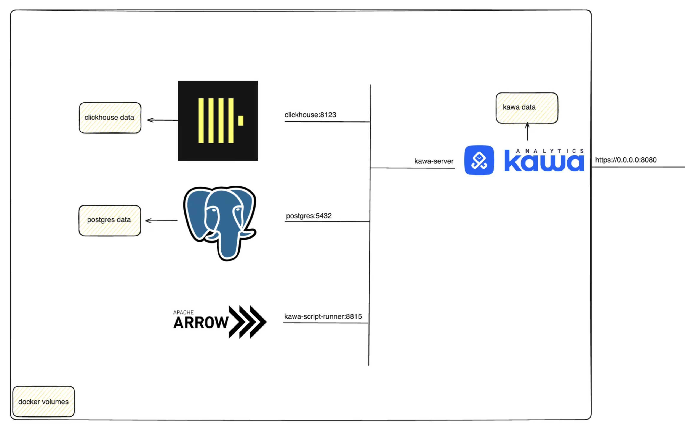
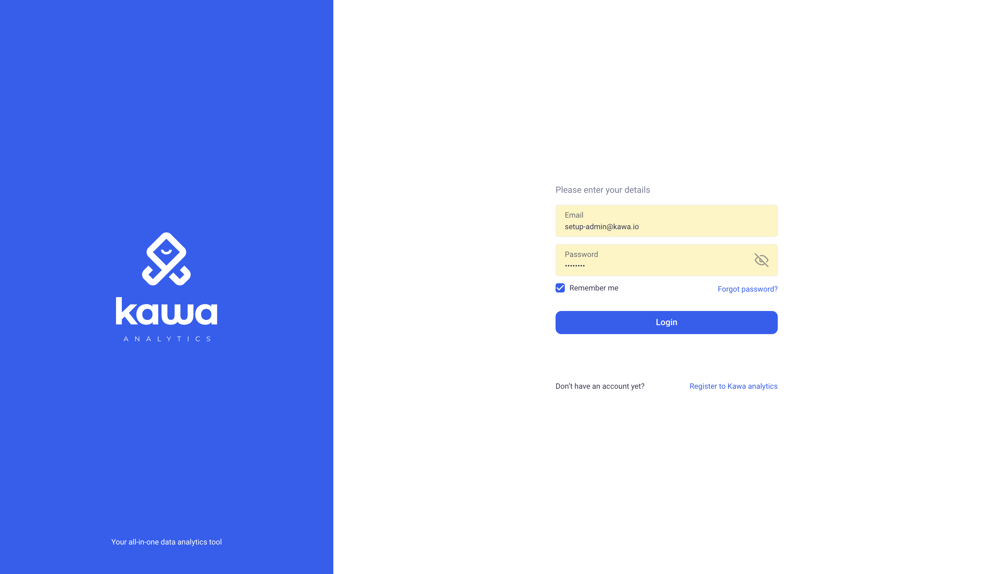

KAWA Docker-compose installation
==============

This setup is ideal for small to medium deployments. 

**It is the recommended way to get started with the KAWA platform.**

Persistence layers are implemented with Clickhouse and Postgres, they can easily be migrated out to standalone servers later on.


It should be paired up with some scheduled backups of the persisted data, either through databases backups, either through disk snapshots. This is not covered by this documentation.

Here is what will be installed:

<p align="center">
  
</p>


## 1. Prerequisites

### 1.a General requirements

We currently support Ubuntu Systems 20.04, 22.04 and 24.04 LTS.
Compatibilty with other linux ditributions should work fine but was not tested.

Here is what you will need:

- You need an account with the ability to run sudo on the target machine

- Access and Credentials to our registry here: [Gitlab registry](registry.gitlab.com/kawa-analytics-dev).

- Working installation of docker + docker compose on the target machine. Please refer to this document for guidance: [Docker Documentation.](https://docs.docker.com/engine/install/ubuntu/)

- A valid KAWA license.

- (Optional): If using Open Id connect, you need a properly configured application and be in possession of the client id and secret.


### 1.b Hardware requirements

__RAM__

For small amounts of data (up to ~200 GB compressed), it is best to use as much memory as the volume of data. For large amounts of data and when processing interactive (online) queries, you should use a reasonable amount of RAM (128 GB or more) so the hot data subset will fit in the cache of pages. Even for data volumes of ~50 TB per server, using 128 GB of RAM significantly improves query performance compared to 64 GB.

__CPU__

KAWA will use all available CPU to maximize performance. So the more CPU - the better. For processing up to hundreds of millions / billions of rows, the recommended number of CPUs is at least 64-cores. We only support AMD64 architecture.

__Storage Subsystem__

SSD is preferred. HDD is the second best option, SATA HDDs 7200 RPM will do. The capacity of the storage subsystem directly depends on the target analytics perimeter.


### 1.c OPEN ID Connect (Optional)

If you wish to configure authentication and authorization with OIDC,
please follow this guide (Example on OKTA) befor going through the installation procedure.

[Configure OIDC with OKTA.](/documentation/CONFIGURE_OIDC_WITH_OKTA.md)


## 2. Installation procedure

Please follow those steps to install KAWA.
The general flow is:
- Clone the install package on the target machine
- Run the installation script
- Perform the initial configuration: such as setup the admin password, upload the license, etc.

### 2.a Install the KAWA Server

1- Clone this repository in the directory you want to install KAWA in: `git clone https://github.com/kawa-analytics/kawa-docker-install.git`

2- Input the credentials to access gitlab registry in the following file: `assets/kawa-registry.credentials`. Replace the first line by your token name, the second by the token value. 
Those credentials should have been communicated to you by the KAWA support team.

Here is an example of a valid file:

```
wayne-enterpises
GbT3zdqLPofY3RTdR56
```

3- Lastly, run the installation script:

```
sudo ./install.sh
```

> __SMTP:__ You will be asked if you wish to configure SMTP. If that is the case, you will be prompted for a SMTP username and a password. The configuration of the SMTP server itself will be done later on (host, port, etc..)

> __OIDC:__ You will be prompted if you wish to use Open ID Connect (OIDC) for authenticating users. If you say yes, you will be prompted for the client secret, generated in step 1.c.


> __HTTPS:__ You will be prompted if you wish to use HTTPS to connect to KAWA. If it is the case, you will have to provide your ssl certificate (.crt) and your private key (.key) files. 

> __DATA DIRECTORY:__ During the installation process, you will be asked to
specify a data directory. Make sure you have enough space to store all your data. It will be the mountpoint for all your docker volumes. It is recommended to backup this directory once every day for disaster recovery. 

This data directory will contain 3 subdirectories,
- one for postgres data: `pgdata`
- one for clickhouse data `clickhousedata` 
- one for the files that have been uploaded by users in kawa: `kawadata`


### 2.b Test login on the WEB UI

4- Connect to the web server from a web browser to test the installation:

By default, KAWA will listen on port 8080.
Make sure to use the correct protocol HTTP vs HTTPS depending on what you configured.

The default credentials are:
```
login: setup-admin@kawa.io
password: changeme
```

<p align="center">
  
</p>


## 3. Initial configuration

The initial confguration can be done following the documentation hosted here: [KYWY doc github](https://github.com/kawa-analytics/kywy-documentation).

Follow the README and then:  [Initial setup Notebook](https://github.com/kawa-analytics/kywy-documentation/blob/main/05_initial_instance_configuration.ipynb)

