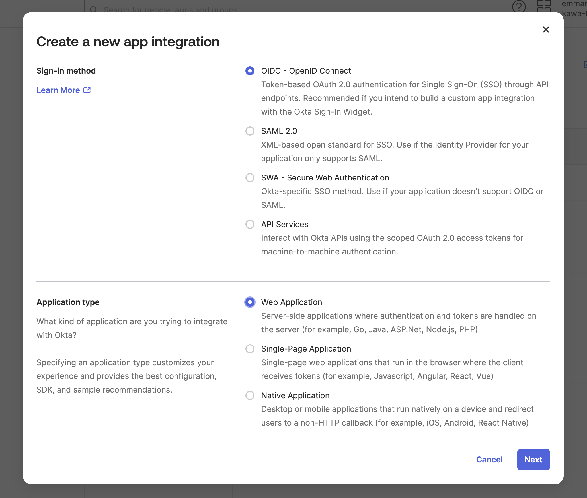
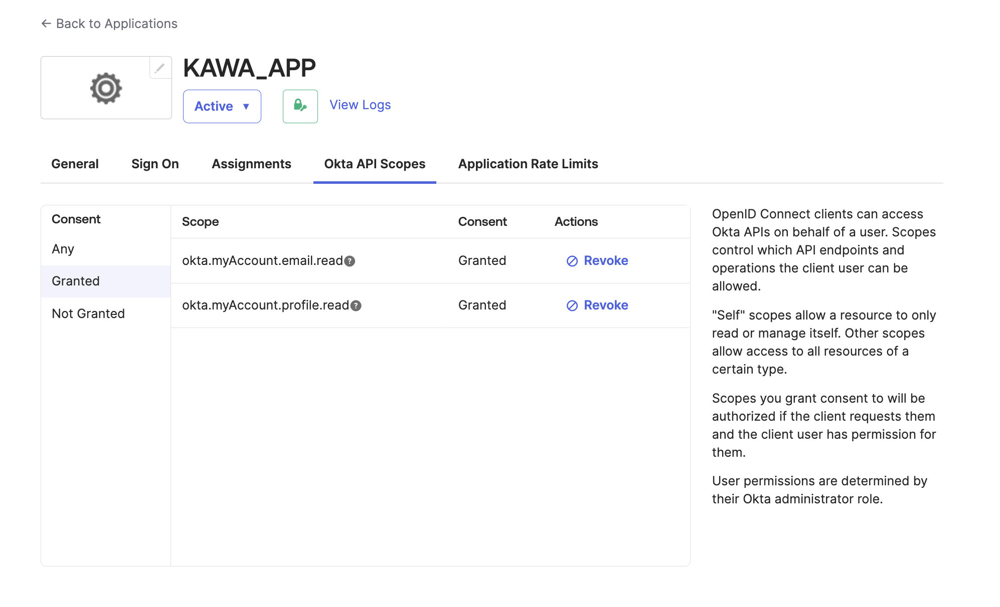
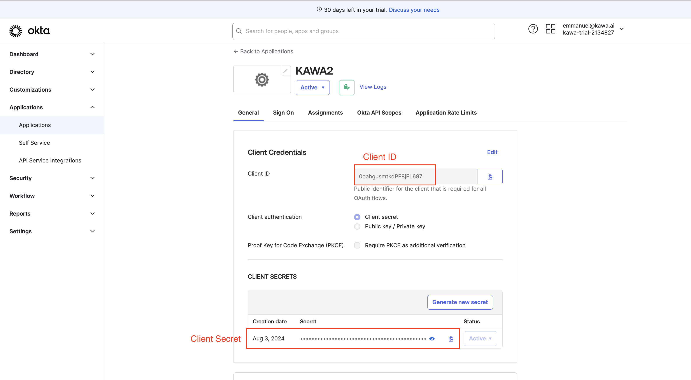

Configure OIDC with OKTA
==============

In order to use the OIDC protocol to authenticate users in KAWA, 
you need to configure an application integration. This document illustrates that process with OKTA.

## 1. Create a new application integration

From your OKTA admin dashboard, go to Applications > Create App integration.

Please use the following configuration:

Sign-in method = `OIDC` and Application type = `Web Application`.

  

### 1.a General settings

Please specify the application name and upload a logo if you wish (logos are available in the logos directory).
Please tick both `Authorization Code` and `Refresh Token`. (Refresh Token is not ticked by default and is required for KAWA to work properly)

  

### 1.b Other settings

The sign-in and sign-out url are ignored.
It is recommended to use a limitation of access to specific groups.

When you are done, click on Save.

### 1.c Additional recommendations

When the app integration is created, it is recommended to enforce a rotation of the refresh tokens.
In order to set it up, go to GENERAL and edit the GENERAL SETTINGS section, set Refresh token behavior to `Rotate token after every use`.

### 1.d Configure the scopes

From within the Okta API Scopes tab, please grant:

- `okta.myAccount.email.read`
- `okta.myAccount.profile.read`

  

## 2. Required informartion for connecting to KAWA

In order to complete KAWA's installation, you will need four values:

- The client id and the client secret:

  

- The open id issuer: `https://********.okta.com/oauth2/default` (Replace the * by your subdomain)

- The client host: Will be the entire URL to access KAWA internally

