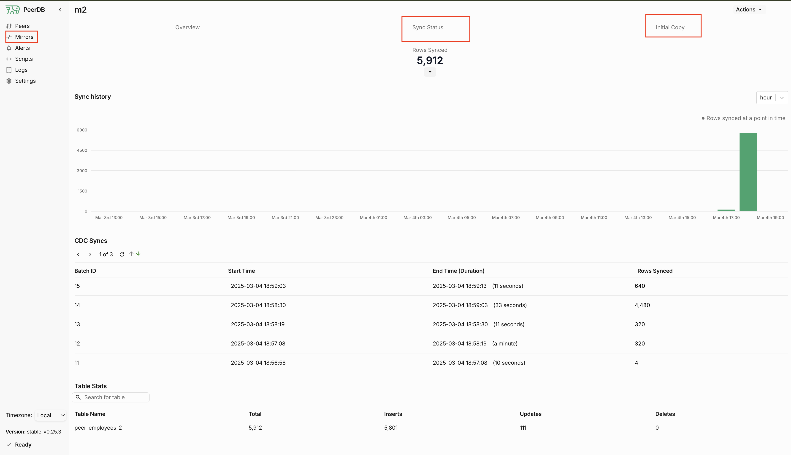

# Guide: Configure CDC between Aurora and Clickhouse

## 1 Configure logical replication on the Aurora Cluster

We require Aurora with engine aurora-postgresql, version 16.3 or above.

The two parameters indicated below must be set to turn on logical replication (`rds.logical_replication`)
and the correct `wal_sender_timeout`.

```hcl
resource "aws_rds_cluster_parameter_group" "aurora_pg16_params" {
  name        = "aurora-pg16-logical-replication"
  family      = "aurora-postgresql16"
  description = "Aurora PostgreSQL 16 parameter group with logical replication"

  parameter {
    name  = "rds.logical_replication"
    value = "1"
    apply_method = "pending-reboot" 
  }
  parameter {
    name  = "wal_sender_timeout"
    value = "0"
  }
}
```

> Nodes of the cluster must be rebooted for the logical replication to be in effect.

In order to check that the parameters are applied:

```sql
SHOW rds.logical_replication
-- Should return: on

SHOW wal_sender_timeout
-- Should return: 0
```

## 2 Configure the databases for replication

### 2.1 Configuration of Aurora

Run this script <strong><span style="color: red;">in the database</span></strong> that you wish to replicate.
Indicate a password of your choice and the schema you wish to replicate.

```sql
-- Create the user for replication
CREATE USER peerdb_user PASSWORD 'your_password';

-- Grant correct permissions in the CURRENT database
GRANT USAGE ON SCHEMA "your_schema" TO peerdb_user;
GRANT SELECT ON ALL TABLES IN SCHEMA "your_schema" TO peerdb_user;
ALTER DEFAULT PRIVILEGES IN SCHEMA "your_schema" GRANT SELECT ON TABLES TO peerdb_user;

-- Bypass RLS (if this is wanted)
ALTER USER peerdb_user BYPASSRLS;

-- Create a replication with all the tables
-- (You can amend this if you only wish to publish a few tables from the schema)
GRANT rds_replication TO peerdb_user ;
CREATE PUBLICATION peerdb_publication FOR ALL TABLES;
```


### 2.2 Configuration of Clickhouse

> Important: Please update the docker compose file from https://github.com/kawa-analytics/kawa-docker-install/blob/main/docker-compose.yml. Clickhouse service exposes port 9000 and adds `extra_hosts` directive.

```sql
-- Creates a database to store the replicated tables and a user with the correct
-- permissions inside
CREATE DATABASE peerdb;
CREATE USER peerdb_user IDENTIFIED BY 'your_password';
GRANT INSERT, SELECT, DROP, CREATE TABLE ON peerdb.* to peerdb_user;
GRANT CREATE TEMPORARY TABLE, s3 on *.* to peerdb_user;
GRANT ALTER ADD COLUMN ON peerdb.* to peerdb_user;
```

## 3 Run PeerDB services

On a linux server which has access to both the Aurora Writer node and to the KAWA clickhouse server:
 
```bash
git clone --recursive https://github.com/PeerDB-io/peerdb.git
cd peerdb
docker compose up -d
```

Once that is started, you should be able to access PeerDB's GUI from your browser: http://hostname:3000

## 4 Configure PeerDB

### 4.1 Create the peers

Connect to peerDB using psql:
You might need to run:
```bash
sudo apt-get update
sudo apt-get install postgresql-client
```

Once psql is installed:
```bash
psql "port=9900 host=localhost password=peerdb"
```

And then:
```sql

-- Connect to Clickhouse
-- (Make sure to use correct password and host)
CREATE PEER destination FROM CLICKHOUSE
WITH
(
    host='your_hostname',
    port=9000,
    user='peerdb_user',
    password='your_password',
    database='peerdb',
    disable_tls = true
);


-- Connection MUST be done to the writer node!!!
-- (Logical replication from reader nodes is NOT supported)
-- (Make sure to use correct password, host and source database)
CREATE PEER source FROM POSTGRES
WITH
(
    host='aurora-pg16-writer.xyz.eu-west-1.rds.amazonaws.com',
    port=5432,
    user='peerdb_user',
    password='your_password',
    database='your_database'
);
```

### 4.2 Create the mirror

Ref doc is here: https://docs.peerdb.io/sql/commands/create-mirror

Still from the psql client, connected to peerdb:

```sql
CREATE MIRROR mirror FROM source TO destination
WITH TABLE MAPPING (
  <schema_name>.<source_table_name>:<target_table_name>,
  <schema_name>.<source_table_name>:<target_table_name>
  ...
)
WITH(
    do_initial_copy=true,
    publication_name='peerdb_publication'
);
```


## 5 Monitoring

We recommand to use the GUI to monitor the mirror status and operations.

It provides a status per mirror:
<p align="center">
  
</p>

It also shows logs for synchronisation:
<p align="center">
  
</p>


PeerDB logs can be found on the server where it was installed using common docker compose logging tools: `docker compose logs -f` etc..

For connection issues, also check logs on AWS for Aurora.


## 6 Connecting to KAWA

In order to connect the synchronized tables in KAWA, use the LIVE CONNECT datasources:

<p align="center">
  
</p>

<p align="center">
  
</p>


## 7 Considerations

1) Aurora Logical replication DOES NOT handle DELETE and TRUNCATE statements (It only captures inserts and updates)

2) Clickhouse does not guarantee unicity like postgres does. Instead, it works with eventual unicity, meaning that a background task will remove duplicate records. As a result, when rows are updated, new versions are appended into clickhouse and will eventually be removed. 

3) If the clickhouse server becomes unavailable, PeerDB will catchup automatically after the 
next write in the source database.

If required, __KAWA__  will add a feature to show data only of the latest version to avoid duplicates in downstream computations.


